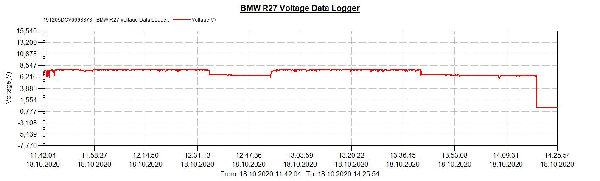

# Datastore
## Data Collections for Engine 226/2
### Generator Type
* Bosch LJ CJE 60/6/1800 R 5

### [voltage/2020_06_06_bmw_r27_voltage_chart_start_and_load.csv](voltage/2020_06_06_bmw_r27_voltage_chart_start_and_load.csv)

* start up tests 
* engine idled

### [voltage/2020_07_12_bmw_r27_voltage_chart_driving.csv](voltage/2020_07_12_bmw_r27_voltage_chart_driving.csv)

* general test run (flashers, brake light)
* no head lamp turned on
* temperature about 20+ degrees centigrade

### [voltage/2020_10_18_bmw_r27_voltage_chart_driving.csv](voltage/2020_10_18_bmw_r27_voltage_chart_driving.csv)

* general test run (flashers, brake light) 
* parking light turned on during drive
* temperature about 9 degrees centigrade

### [voltage/2020_11_08_bmw_r27_voltage_chart_driving.csv](voltage/2020_11_08_bmw_r27_voltage_chart_driving.csv)

* general test run (flashers, brake light) 
* parking and main head light turned on during drive
* temperature about 10 degrees centigrade

### [voltage/2021_03_31_bmw_r27_voltage_chart_driving.csv](voltage/2021_03_31_bmw_r27_voltage_chart_driving.csv)

* general test run after rebuild of generator (flashers, brake light, front parking light)
* temperature about 22 degrees centigrade
* new ignition coil

### [voltage/2021_07_22_bmw_r27_voltage_chart_driving.csv](voltage/2021_07_22_bmw_r27_voltage_chart_driving.csv)

* sunset test run (main head lamp 6V/35W turned on, flashers 6V/18W, rear brake light 6V/21W)
* temperature about 20 degrees centigrade

### [voltage/2022_09_24_bmw_r27_voltage_chart_driving.csv](voltage/2022_09_24_bmw_r27_voltage_chart_driving.csv)

* about 90km test run (main head lamp 6V/35W always on, flashers 6V/18W, rear brake light 6V/21W)
* temperature about 15 degrees centigrade
* 14:55:13 technical stop cause of closed petrol tap

